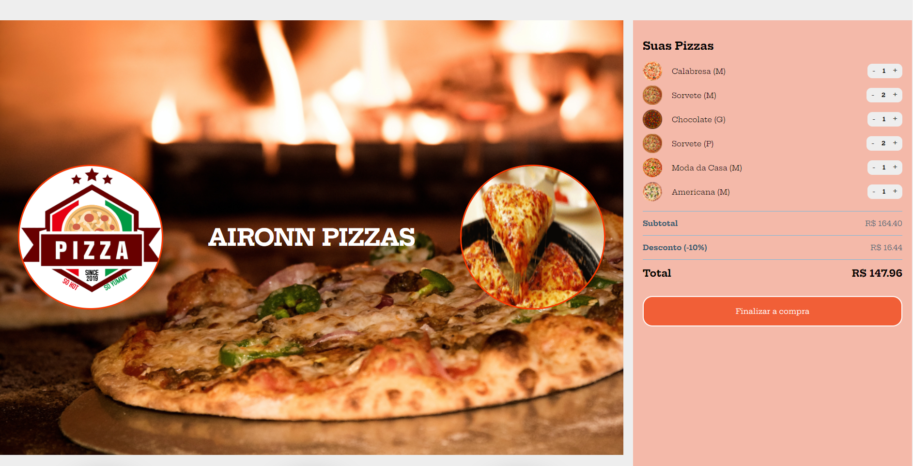

        <h3>Link do projeto abaixo</h3>
        <a href="https://pizza-aironys.netlify.app/" target="_blank">AIRONN PIZZA</a>
    

        <h4>Versão desktop</h4>
        
        
        
        

        <h4>Versão mobile</h4>
        
        
        

